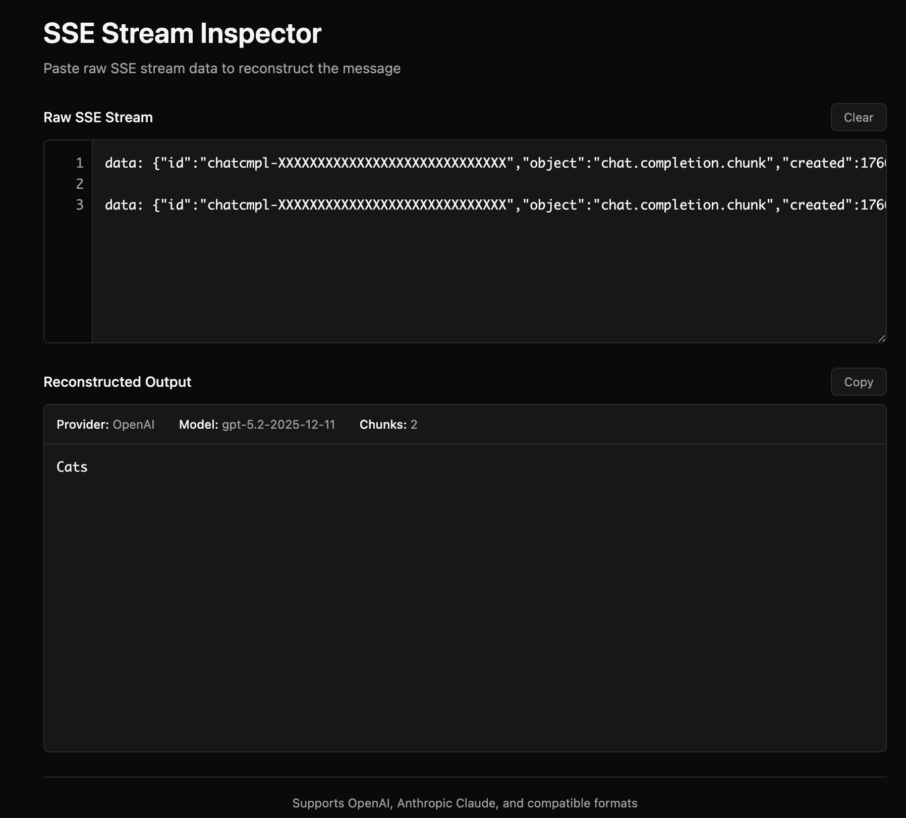

# LLM Stream Inspector

Parse and reconstruct Server-Sent Events (SSE) streams from LLM providers.

https://anvaka.github.io/llm-stream-inspector/



## What?

When you work with LLM APIs (OpenAI, Claude, etc.) in streaming mode, they send data as 
Server-Sent Events - a series of `data: {...}` chunks. Each chunk contains a small piece 
of the response.

This tool takes raw SSE output and reconstructs the original message. Paste the stream,
see the result.

## Supported formats

- **OpenAI** - `choices[0].delta.content`
- **Claude** - `delta.text` in `content_block_delta` events

The parser auto-detects the format based on JSON structure.

## Features

- Line numbers with click-to-navigate on errors
- Best-effort parsing - shows what it can even when some chunks fail
- Metadata extraction (model, tokens, timing)
- Dark mode support
- Works offline

## Local development

```bash
npm install
npm run dev
```

## License

MIT
